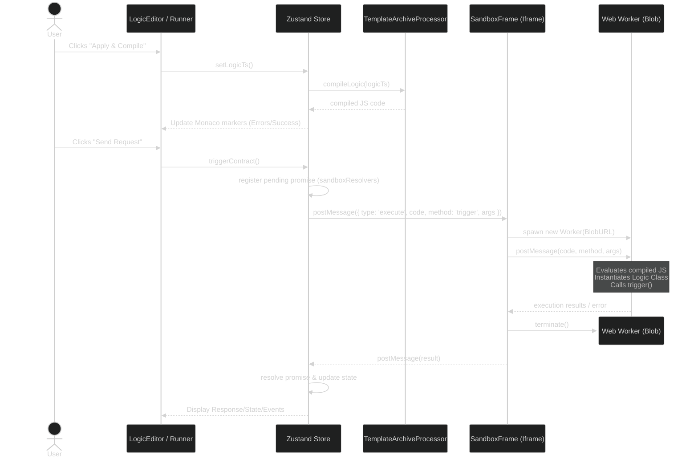

# Template Playground Development Guide

## ❗ Accord Project Development Guide ❗
We'd love for you to help develop improvements to the Template Playground! Please refer to the [Accord Project Development guidelines][apdev] we'd like you to follow.

## Development Setup

To build and run the Template Playground, clone the source code repository and use npm:

```shell
# Clone your Github repository:
git clone https://github.com/<GITHUB_USERNAME>/template-playground.git

# Go to the template-playground directory:
cd template-playground

# Add the main template-playground repository as an upstream remote:
git remote add upstream "https://github.com/accordproject/template-playground.git"

# Install Node.js dependencies (requires Node.js >= 22):
npm install

# Start the development server:
npm run dev
```

## Architecture Overview

The Template Playground supports two primary workflows:

1. **Build (Drafting)**: Authors write template grammar (`.tem.md`) and Concerto models (`.cto`), and test the resulting AST against sample JSON data.
2. **Simulate (Logic Execution)**: Authors write TypeScript logic (`logic.ts`) extending `TemplateLogic`. The playground compiles this logic and executes it securely against contract requests, modifying contract state and emitting events.

The application relies on:
- `@accordproject/cicero-core` for template initialization and parsing.
- `@accordproject/template-engine` for executing logic compilation.
- **Monaco Editor** for code authoring.
- **Zustand** (`src/store/store.ts`) for centralized state management.

## Logic Execution Architecture

The Logic Execution subsystem enables the authoring, compilation, and isolated execution of smart contract logic directly in the browser.

### Pipeline
1. **Authoring**: Users write TypeScript code in the `LogicEditor.tsx`. The editor provides rich intellisense powered by the `TemplateLogic` base class types.
2. **Compilation**: Triggered via `store.compileLogic()`, the playground leverages `TemplateArchiveProcessor.compileLogic()` (from `@accordproject/template-engine`). This step uses `@typescript/twoslash` under the hood to compile the `.ts` file into an executable JavaScript string, stripping away types.
3. **Execution Sandbox**: The application maintains a hidden iframe (`SandboxFrame.tsx`) pointing to `logic-handler.html`. This iframe serves as a secure execution adapter, fully isolated from the parent DOM.
4. **Invocation**: When a user clicks "Init Contract" or "Send Request", `store.executeInSandbox()` dispatches a `postMessage` to the iframe containing the compiled JS code, the method name (`'init'` or `'trigger'`), and the required arguments (data, request, and accumulated state).
5. **Execution**: The iframe intercepts the message and spawns a temporary Web Worker via a Blob URL. The worker `eval`s the compiled logic, instantiates the logic class, and invokes the requested method. It then posts the results (the response, state modifications, and emitted events) or any runtime errors back to the iframe.
6. **Result Routing**: The iframe forwards the result back to the playground parent window. The playground looks up the corresponding pending Promise in the `sandboxResolvers.ts` module map, resolves it with the output, and updates the Zustand store and UI.

### Sequence Diagram



## Error Propagation

Compilation errors flow through a specific pipeline to provide immediate feedback to the developer:
1. `TemplateArchiveProcessor` returns compilation errors during the build step.
2. These errors are stored in `store.compilationErrors`.
3. The `LogicEditor.tsx` maps these errors to Monaco editor markers (via `monaco.editor.setModelMarkers`), highlighting the exact line and column of the syntax or type error.
4. General execution or timeout errors are displayed via the UI's `ProblemPanel`.

## Adapter Layer & Swapping Execution Backends

The execution environment is intentionally decoupled from the UI and state management via a strict adapter boundary: the `executeInSandbox()` method in `store.ts`.

Because the playground relies on a standardized message payload rather than tightly coupled function calls, the execution backend can be easily swapped out without refactoring the UI. Currently, the playground uses a browser-based Web Worker sandbox. 

To swap the current browser-based sandbox for a different backend (e.g., a secure Node.js server, a Dockerized microservice, or a WebAssembly engine):

1. **Replace `SandboxFrame.tsx`**: Remove the hidden iframe component. Depending on your architecture, you might not need a replacement component, or you might replace it with a WebSocket connection manager.
2. **Update `executeInSandbox`**: Modify this function in `store.ts` to dispatch execution payloads to your new backend instead of using `window.postMessage`.
   - **Payload Format**: Your backend should expect the same execution payload: `{ code: string, method: 'init' | 'trigger', args: unknown[] }`.
   - **Transport**: Use `fetch`, WebSockets, or gRPC to send the payload to the backend.
3. **Handle the Response**: Ensure your backend returns the results in the expected format (e.g., the `TriggerResponse` or `InitResponse` objects defined by `TemplateLogic`), and resolve the promise inside `executeInSandbox`. This ensures the rest of the application's state management remains completely unaware of the backend swap.

## Security Model

The logic execution engine relies on a multi-layered security model to protect the parent application from malicious or infinite-looping contract code.

- **Iframe Sandbox**: `SandboxFrame.tsx` mounts `logic-handler.html` using `sandbox="allow-scripts"`. Because it omits `allow-same-origin`, the browser enforces a strict **null origin**, preventing the iframe from accessing the parent's `localStorage`, cookies, or DOM.
- **Content Security Policy (CSP)**: `logic-handler.html` enforces a strict CSP: `default-src 'none'; script-src 'unsafe-inline' 'unsafe-eval' blob:`. It cannot load external scripts or exfiltrate data via network requests.
- **Worker Isolation**: Each execution spawns a new Web Worker via a Blob URL, completely isolating the execution thread and preventing DOM access. The Worker is terminated immediately after completion.
- **Timeout Kill-Switches**: 
  - *Worker-side*: `logic-handler.html` terminates the worker if it exceeds 5000ms.
  - *Client-side*: `store.executeInSandbox()` enforces a 6000ms timeout to reject the promise in case the iframe itself fails to respond.
- **Concurrent Guard**: `store.isExecuting` prevents users from flooding the sandbox with overlapping execution requests.

## Shareable Links

The Playground allows sharing full state via URL fragments (`#data=...`).
- `store.generateShareableLink()` serializes the active template, models, data, and logic (if present).
- `store.loadFromLink()` decompresses the state. If logic is present, it automatically enables the logic feature panels and triggers compilation immediately upon load.

## Testing Guide

The playground implements a dual-layer testing strategy:

1. **Unit Tests (Vitest)**: `src/tests/logic/runtimeAdapter.test.ts`
   - Validates the Zustand store behavior, state accumulation, event emission, and error handling.
   
2. **End-to-End Tests (Playwright)**: `e2e/logic-lifecycle.spec.ts`
   - Validates the complete user workflow in a real browser.
   - **Note**: The E2E tests intercept network requests for TypeScript declaration files (`*.d.ts`) that `@typescript/twoslash` attempts to fetch from the TypeScript CDN. The interceptor forces a `404` response, making the compiler instantly fall back to its bundled definitions and preventing test flakiness.

## Key Files Reference

| File | Responsibility |
| --- | --- |
| `src/store/store.ts` | Central state management, coordinates compilation and sandbox dispatch. |
| `src/components/SandboxFrame.tsx` | Hidden iframe mounting `logic-handler.html`. |
| `public/logic-handler.html` | The execution environment. Spawns Workers for untrusted code. |
| `src/store/sandboxResolvers.ts` | Module-scoped map tracking pending execution promises. |
| `src/editors/LogicEditor.tsx` | Monaco editor configured for TypeScript with auto-completion. |
| `src/components/ContractRunnerPanel.tsx` | The unified panel container for sending logic requests and viewing results. |

[apdev]: https://github.com/accordproject/techdocs/blob/master/DEVELOPERS.md