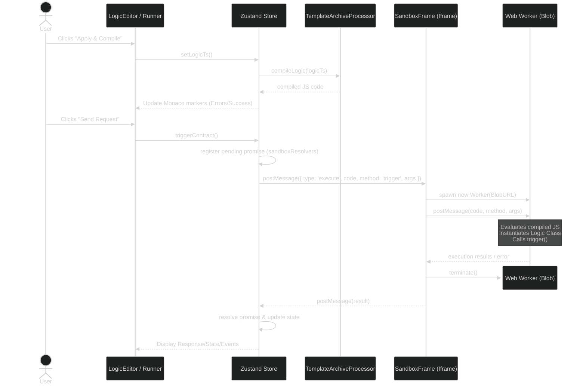

# Template Playground Development Guide

## ❗ Accord Project Development Guide ❗
We'd love for you to help develop improvements to the Template Playground! Please refer to the [Accord Project Development guidelines][apdev] we'd like you to follow.

## Development Setup

To build and run the Template Playground, clone the source code repository and use npm:

```shell
# Clone your Github repository:
git clone https://github.com/<GITHUB_USERNAME>/template-playground.git

# Go to the template-playground directory:
cd template-playground

# Add the main template-playground repository as an upstream remote:
git remote add upstream "https://github.com/accordproject/template-playground.git"

# Install Node.js dependencies (requires Node.js >= 22):
npm install

# Start the development server:
npm run dev
```

## Architecture Overview

The Template Playground supports two primary workflows:

1. **Build (Drafting)**: Authors write template grammar (`.tem.md`) and Concerto models (`.cto`), and test the resulting AST against sample JSON data.
2. **Simulate (Logic Execution)**: Authors write TypeScript logic (`logic.ts`) extending `TemplateLogic`. The playground compiles this logic and executes it securely against contract requests, modifying contract state and emitting events.

The application relies on:
- `@accordproject/cicero-core` for template initialization and parsing.
- `@accordproject/template-engine` for executing logic compilation.
- **Monaco Editor** for code authoring.
- **Zustand** (`src/store/store.ts`) for centralized state management.

## Logic Execution Architecture

The Logic Execution subsystem enables the authoring, compilation, and isolated execution of smart contract logic directly in the browser.

### Pipeline
1. **Authoring**: Users write TypeScript code in the `LogicEditor.tsx`. The editor provides rich intellisense powered by the `TemplateLogic` base class types.
2. **Compilation**: Triggered via `store.compileLogic()`, the playground leverages `TemplateArchiveProcessor.compileLogic()` (from `@accordproject/template-engine`). This step uses `@typescript/twoslash` under the hood to compile the `.ts` file into an executable JavaScript string, stripping away types.
3. **Execution Sandbox**: The application maintains a hidden iframe (`SandboxFrame.tsx`) pointing to `logic-handler.html`. This iframe serves as a secure execution adapter, fully isolated from the parent DOM.
4. **Invocation**: When a user clicks "Init Contract" or "Send Request", `store.executeInSandbox()` dispatches a `postMessage` to the iframe containing the compiled JS code, the method name (`'init'` or `'trigger'`), and the required arguments (data, request, and accumulated state).
5. **Execution**: The iframe intercepts the message and spawns a temporary Web Worker via a Blob URL. The worker `eval`s the compiled logic, instantiates the logic class, and invokes the requested method. It then posts the results (the response, state modifications, and emitted events) or any runtime errors back to the iframe.
6. **Result Routing**: The iframe forwards the result back to the playground parent window. The playground looks up the corresponding pending Promise in the `sandboxResolvers.ts` module map, resolves it with the output, and updates the Zustand store and UI.

### Sequence Diagram


```mermaid
%%{init: {'theme': 'dark'}}%%
sequenceDiagram
    actor User
    participant UI as LogicEditor / Runner
    participant Store as Zustand Store
    participant Compiler as TemplateArchiveProcessor
    participant Iframe as SandboxFrame (Iframe)
    participant Worker as Web Worker (Blob)

    User->>UI: Clicks "Apply & Compile"
    UI->>Store: setLogicTs()
    Store->>Compiler: compileLogic(logicTs)
    Compiler-->>Store: compiled JS code
    Store-->>UI: Update Monaco markers (Errors/Success)

    User->>UI: Clicks "Send Request"
    UI->>Store: triggerContract()
    Store->>Store: register pending promise (sandboxResolvers)
    Store->>Iframe: postMessage({ type: 'execute', code, method: 'trigger', args })
    
    Iframe->>Worker: spawn new Worker(BlobURL)
    Iframe->>Worker: postMessage(code, method, args)
    
    Note over Worker: Evaluates compiled JS<br/>Instantiates Logic Class<br/>Calls trigger()
    
    Worker-->>Iframe: execution results / error
    destroy Worker
    Iframe->>Worker: terminate()
    Iframe-->>Store: postMessage(result)
    Store->>Store: resolve promise & update state
    Store-->>UI: Display Response/State/Events
```

## Error Propagation

Compilation errors flow through a specific pipeline to provide immediate feedback to the developer:
1. `TemplateArchiveProcessor` returns compilation errors during the build step.
2. These errors are stored in `store.compilationErrors`.
3. The `LogicEditor.tsx` maps these errors to Monaco editor markers (via `monaco.editor.setModelMarkers`), highlighting the exact line and column of the syntax or type error.
4. General execution or timeout errors are displayed via the UI's `ProblemPanel`.

## Execution Boundary & Sandbox Communication

The execution environment is isolated from the UI and state management via the `executeInSandbox()` helper method in `store.ts`.

The playground uses asynchronous `postMessage` communications to evaluate contract logic inside a browser-based Web Worker (`logic-handler.html`). This structure decouples the user interface from the evaluation process, keeping execution asynchronous and preventing user-authored code from blocking the main thread.

## Security Model

The logic execution engine relies on a multi-layered security model to protect the parent application from malicious or infinite-looping contract code.

- **Iframe Sandbox**: `SandboxFrame.tsx` mounts `logic-handler.html` using `sandbox="allow-scripts"`. Because it omits `allow-same-origin`, the browser enforces a strict **null origin**, preventing the iframe from accessing the parent's `localStorage`, cookies, or DOM.
- **Content Security Policy (CSP)**: `logic-handler.html` enforces a strict CSP: `default-src 'none'; script-src 'unsafe-inline' 'unsafe-eval' blob:`. It cannot load external scripts or exfiltrate data via network requests.
- **Worker Isolation**: Each execution spawns a new Web Worker via a Blob URL, completely isolating the execution thread and preventing DOM access. The Worker is terminated immediately after completion.
- **Timeout Kill-Switches**: 
  - *Worker-side*: `logic-handler.html` terminates the worker if it exceeds 5000ms.
  - *Client-side*: `store.executeInSandbox()` enforces a 6000ms timeout to reject the promise in case the iframe itself fails to respond.
- **Concurrent Guard**: `store.isExecuting` prevents users from flooding the sandbox with overlapping execution requests.

## Template Rendering Sandbox

Rendering the agreement preview is user-code execution too: the Template Engine compiles the template's `{}` formulas and runs them with `new Function`. A shared link carries the template verbatim, so a formula written by whoever made the link would otherwise run in the page of whoever opens it. The rebuild pipeline therefore runs inside its own sandbox, separate from the logic sandbox above.

### Pipeline
1. `store.rebuild()` validates the inputs on the main thread (`validateBeforeRebuild`; CTO and JSON parsing only, no user code).
2. It calls `rebuildInSandbox()` (`src/store/rebuildSandbox.ts`), which posts the template, model and data strings to the rendering iframe and returns a Promise keyed by `requestId`.
3. `RebuildSandboxFrame.tsx` hosts a hidden iframe loaded from `srcdoc` with `sandbox="allow-scripts"`. The document (`src/sandbox/rebuildSandboxDocument.ts`) contains only a small bootstrap script that spawns a classic `blob:` Worker, loads the worker bundle into it with `importScripts()`, and relays messages.
4. The worker (`src/sandbox/rebuild.worker.ts`) first runs `workerEnvironment.ts`, which exposes the worker global as `window` with an empty `document` so the engine takes its browser code paths (without a `window` it assumes Node and fails to start). It then imports the engine bundle, rebuilds the `ModelManager` from the CTO source, runs `TemplateMarkTransformer` and `TemplateMarkInterpreter.generate()` (`src/sandbox/rebuildPipeline.ts`), and posts the resulting CiceroMark JSON back.
5. The main thread converts CiceroMark to HTML with `@accordproject/markdown-transform`, which runs no user code, and stores it in `agreementHtml`.

Errors are reduced to plain data in the worker (`serializeRebuildError`) in the exact shape `formatError()` reads, so the Problems panel shows the same text as before.

### Security Model
- **Null origin**: the iframe omits `allow-same-origin`, so it cannot reach the parent's DOM, cookies or `localStorage` (where the AI provider keys live).
- **Runtime Content Security Policy**: the policy is generated when the frame mounts because it must name the worker bundle's exact URL, which is hashed at build time (`'self'` matches nothing inside an opaque origin). It is `default-src 'none'; script-src 'nonce-…' <worker bundle URL> 'unsafe-eval'; worker-src blob:; connect-src https://playgroundcdn.typescriptlang.org; base-uri 'none'; form-action 'none'`. Naming the one file rather than the whole origin stops formula code from using `importScripts()` to request any other playground URL; `workerScriptSource()` rejects any URL that could widen the policy. `'unsafe-eval'` is required for the engine's `new Function`; the TypeScript CDN is required because the compiler fetches its `lib.*.d.ts` files from there.
- **Blob worker**: a worker created from a `blob:` URL inherits its creator's policy, so the rules above apply to the code the engine evaluates. A worker has no DOM, so there are no image, script or navigation side channels either; with `connect-src` limited to the CDN, formula code has no way to send data anywhere it controls.
- **Bundle loading**: the blob worker's only statement is `importScripts(<worker bundle URL>)`. It is a *classic* worker because Chrome cannot start a module worker from a `blob:` URL inside a null-origin document, and it uses `importScripts()` because a null origin is cross-origin to the playground: module scripts would need CORS headers the static production host does not send, `importScripts()` needs none. In production the bundle is the self-contained IIFE emitted by Vite's worker build (`worker` in `vite.config.ts`, which also injects the Node globals the Accord Project libraries expect). The dev server serves workers as ES modules, which a classic worker cannot load, so `vite-plugin-rebuild-worker.ts` (dev only) bundles the worker with esbuild and serves it at `/__rebuild-worker.js`.
- **Message authentication**: the frame accepts messages only from its parent window; the parent accepts messages only when `event.origin === "null"` **and** `event.source` is the frame's own `contentWindow`. Formula code inside the worker can post anything, so the frame relays only the four rendering reply types (result, pong, worker-ready, worker-error), rebuilt from checked fields; anything else, such as a forged message aimed at the logic sandbox, is dropped. Each relayed message is stamped with the *generation* of the worker that sent it: the page numbers every worker it asks for and ignores messages from any other one. Replies are still treated as untrusted data: a result only becomes HTML through `markdown-transform` and is sanitised with DOMPurify before display, and errors are shown as text.
- **One worker per template that runs code**: formula code runs in the worker's global scope and could tamper with it, for example by replacing its message handler to fake every later preview. So a render whose template may run code (it contains a formula `{}` or a `condition=` attribute, the only two constructs the engine executes; `templateMayRunCode()` matches them loosely) gets a worker that has never run code, runs alone on it, and that worker is replaced as soon as it answers. The replacement starts loading straight away, so the next render usually does not wait. Templates without code keep sharing the warm worker. A render that is still waiting when a newer one needs a fresh worker settles with the newer render's outcome.
- **Heartbeat kill-switch**: rendering has no fixed time limit, because the first render downloads the TypeScript `lib.*.d.ts` files and can take a long time on a slow network. Instead, while a render is in progress `rebuildInSandbox()` pings the worker every 2 s. A worker waiting on the network still answers; one stuck in a formula that never returns cannot. If a ping to a worker that has finished loading its bundle (it announces this with `rebuild-worker-ready`) stays unanswered for 30 s, the render fails with a clear message and the frame terminates and respawns the worker. The stall is measured from the unanswered ping rather than from the last reply, so background tabs, where browsers throttle timers to about once a minute, do not trigger it. Before the worker is loaded, `importScripts()` blocks it by design, so it is not held to the heartbeat. A 5-minute ceiling per render catches anything else (a bundle that never loads, a worker that answers pings but never the request). On the main thread such a formula would have frozen the page; here only the preview fails.

## Shareable Links

The Playground allows sharing full state via URL fragments (`#data=...`).
- `store.generateShareableLink()` serializes the active template, models, data, and logic (if present).
- `store.loadFromLink()` decompresses the state. If logic is present, it automatically enables the logic feature panels and triggers compilation immediately upon load.

## Testing Guide

The playground implements a dual-layer testing strategy:

1. **Unit Tests (Vitest)**: `src/tests/logic/runtimeAdapter.test.ts`
   - Validates the Zustand store behavior, state accumulation, event emission, and error handling.
   
2. **End-to-End Tests (Playwright)**: `e2e/logic-lifecycle.spec.ts`
   - Validates the complete user workflow in a real browser.
   - **Note**: The E2E tests intercept network requests for TypeScript declaration files (`*.d.ts`) that `@typescript/twoslash` attempts to fetch from the TypeScript CDN. The interceptor forces a `404` response, making the compiler instantly fall back to its bundled definitions and preventing test flakiness.

## Key Files Reference

| File | Responsibility |
| --- | --- |
| `src/store/store.ts` | Central state management, coordinates compilation and sandbox dispatch. |
| `src/store/rebuildSandbox.ts` | Main-window bridge to the template rendering sandbox (request routing, timeouts, restart). |
| `src/components/RebuildSandboxFrame.tsx` | Hidden null-origin iframe that hosts the rendering worker. |
| `src/sandbox/rebuildSandboxDocument.ts` | Builds the sandbox document and its runtime Content Security Policy. |
| `src/sandbox/rebuild.worker.ts` | Worker entry: runs the Template Engine and posts CiceroMark JSON back. |
| `src/sandbox/rebuildPipeline.ts` | The render itself (ModelManager, transformer, interpreter) and error serialisation. |
| `src/sandbox/workerEnvironment.ts` | Worker prelude: exposes `window`/`document` so the engine takes its browser code paths. |
| `vite-plugin-rebuild-worker.ts` | Dev server only: serves the worker as the classic script `importScripts()` needs. |
| `src/components/SandboxFrame.tsx` | Hidden iframe mounting `logic-handler.html`. |
| `public/logic-handler.html` | The execution environment. Spawns Workers for untrusted code. |
| `src/store/sandboxResolvers.ts` | Module-scoped map tracking pending execution promises. |
| `src/editors/LogicEditor.tsx` | Monaco editor configured for TypeScript with auto-completion. |
| `src/components/ContractRunnerPanel.tsx` | The unified panel container for sending logic requests and viewing results. |

[apdev]: https://github.com/accordproject/techdocs/blob/master/DEVELOPERS.md