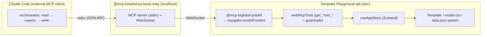

# WebMCP PoC — findings & handover

> **Status:** Proof of concept, working. Not production-ready. This document
> records what was explored, what was built, what we learned, and the open
> design questions for the engineer who picks up the real implementation.
>
> **Scope of the PoC:** prove that Template Playground can expose **in-page
> tools** to an external AI agent (Claude Code) over WebMCP, so the agent can
> read and write the playground's panels and drive the authoring flow itself —
> with no app-hosted model, no API keys, and no bespoke chat UI.

---

## TL;DR of the result

- An external agent (Claude Code) can list and call tools that live **in the
  page** and mutate the Zustand store directly. Reads and writes to the
  Template / Model / Data panels work end-to-end.
- The agent does the reasoning (e.g. "infer a Concerto model from this
  template"); the page only exposes **thin, guardrailed primitives**.
- No app AI provider, no API keys, no chat UI were used. That is the point:
  once WebMCP ships in browsers, the model + auth come from the user's agent.

---

## How the design evolved (thought process)

1. **First cut — one "smart" tool.** `infer_model_from_template` read the
   template, inferred a Concerto model *procedurally* (regex over TemplateMark
   bindings), wrote `model.cto`, and jumped to the Model & Data step. It worked
   as a demo but bakes the intelligence into the page.
2. **Pivot — move intelligence to the agent.** The procedural inferencer was a
   dead end for a real product: the whole value of WebMCP is that the *agent*
   brings the model. We removed it and replaced the single tool with **panel
   primitives** (`get_*` / `set_*`) that the agent orchestrates. Inference now
   happens in Claude.
3. **Guardrails on writes.** Because the agent writes free-form content, every
   write validates before committing: `set_model` parses the CTO with the
   Concerto `ModelManager` (bundled AP namespaces, offline) **and** requires a
   `@template` root concept; `set_data` requires valid JSON. Rejections return a
   message the agent can act on, and the panel is left unchanged.

---

## Architecture (as built)



Two host paths were validated:

- **Native:** Chrome with `chrome://flags#enable-webmcp-testing` exposes
  `navigator.modelContext` directly. This is the target once WebMCP ships.
- **Polyfill + relay (dev harness):** `@mcp-b/global` polyfills
  `navigator.modelContext` in any browser, and `@mcp-b/webmcp-local-relay`
  bridges the page's tools over a localhost WebSocket to a stdio MCP server that
  Claude Code connects to. This is **dev-only scaffolding** and should not ship.

---

## What was built

New (`src/mcp/`):

- `tools.ts` — `webMcpTools`: `get_template_text`, `get_model`, `get_data`,
  `set_template_text`, `set_model`, `set_data`. Thin wrappers over the store;
  writes are guardrailed. Tool descriptions double as the agent-facing prompt
  (e.g. `set_model` instructs the agent to add the `@template` decorator).
- `guardrails.ts` — `validateConcertoModel` (parses via `ModelManager` +
  bundled namespaces, requires a `@template` concept) and `validateJson`.
- `registerWebMcp.ts` — feature-detects `navigator.modelContext`, registers all
  tools, returns a combined cleanup; no-op (dev hint) when the API is absent.
- `navigator-modelcontext.d.ts` — ambient types for the experimental API,
  isolated to contain churn.
- `devRelay.ts` — **dev-only** loader for the `@mcp-b/global` polyfill and the
  relay embed. Gated by `import.meta.env.DEV`.

Changed:

- `src/components/designV2/DesignV2Layout.tsx` — `useEffect` registers the tools
  when Design v2 is mounted; cleans up on unmount. Legacy UI untouched.
- `src/main.tsx` — calls `setupDevRelay()` under `import.meta.env.DEV` before
  render (so the polyfill exists before any tool registers).

Tests:

- `src/tests/mcp/guardrails.test.ts` — covers Concerto validity, the
  `@template` requirement, and JSON validity (runs green).

No new **runtime** dependencies: the polyfill/relay are loaded from CDN in dev
only. A real implementation should decide whether to vendor them or drop them
entirely (see below).

---

## Setup & running the PoC

### Prerequisites

- Node 20+ and the repo dependencies installed (`npm ci`, or `yarn`).
- One of the two host paths below:
  - **Native:** Chrome with `chrome://flags#enable-webmcp-testing` enabled, or
  - **Dev relay:** an MCP-capable agent (e.g. Claude Code) + `npx` (the relay is
    fetched on demand). This is what the PoC was driven with.

### Start the app

```bash
npm install        # or: yarn
npm run dev        # http://localhost:5173
```

Open the app, enable **Design v2** in Settings, and make sure the Text step has a
template with bindings. The tools register when the Design v2 layout mounts.

### Option A — dev relay + Claude Code (no Chrome flag)

1. Register the relay as an MCP server:
   ```bash
   claude mcp add webmcp-local-relay -- npx -y @mcp-b/webmcp-local-relay@latest --host :: --port 9333
   ```
   `--host ::` matters on macOS: the page dials the IPv6 loopback `[::1]`, and a
   `127.0.0.1`-only bind is refused. `--port 9333` matches the embed port pinned
   in `devRelay.ts`.
2. Hard-reload the tab (Cmd-Shift-R) so the embed re-registers the tools.
3. In the agent: `webmcp_list_sources` (confirms the tab is connected) and
   `webmcp_list_tools` (shows the six panel tools). Orchestrate, e.g.
   `get_template_text` → reason about the model → `set_model`.

`src/main.tsx` loads the `@mcp-b/global` polyfill and the relay embed under
`import.meta.env.DEV` only, so none of this ships in a production build.

### Option B — native Chrome flag

1. Enable `chrome://flags#enable-webmcp-testing` and relaunch Chrome.
2. Load the app with Design v2 on. `navigator.modelContext` is real, so the tools
   register on mount without the polyfill/relay.
3. Drive them from Chrome's WebMCP testing surface / an in-browser agent.

---

## What we learned

- **The primitive surface is the right shape for a PoC**, but it pushes all
  orchestration onto the agent. A real product likely wants a small number of
  **task-level** tools (see open questions) layered over these primitives.
- **Guardrails are essential.** Free-form agent writes will produce invalid
  schemas; validating on write (and returning actionable errors) is what makes
  the loop reliable. This is the part most worth keeping.
- **Host/transport is churny and macOS has an IPv4/IPv6 loopback gotcha.** Keep
  all of it behind `registerWebMcp.ts` + the `.d.ts` + `devRelay.ts` so the app
  code never touches it.
- **The `navigator.modelContext` shape is still moving** (the polyfill already
  renamed the primary to `document.modelContext` with a deprecated `navigator`
  alias). Pin versions and re-verify against the shipping Chrome API.

---

## Handover: designing the real solution

### 1. Reusing the existing AI Chat assets

The current AI Chat (`src/ai-assistant/`) has two separable parts:

- **Keep / reuse: the prompts.** `src/ai-assistant/prompts.ts` encodes hard-won
  domain rules (how `@template` concepts, clauses, `{{#clause}}` / `{{#ulist}}`
  scoping, optional fields, and TypeScript blocks work in TemplateMark against a
  Concerto model). That knowledge is exactly what an external agent needs and
  should be surfaced — via tool descriptions and/or a WebMCP **prompt/resource**
  — rather than rewritten.
- **Expect to retire: the provider + auth + chat UX.** `llmProviders.ts`
  (OpenAI/Anthropic/Google/Mistral/Ollama streaming), the API-key handling, and
  the chat panel exist only because the app hosts the model today. **Once WebMCP
  ships, the model and auth come from the user's agent**, so this layer largely
  disappears. Don't design the WebMCP tools around it.

### 2. Tool surface — the core design question

The PoC exposes CRUD primitives. Decide deliberately between (or blend):

- **Primitives** (`get_*`/`set_*`): maximum agent flexibility, minimum app
  intelligence. Simple, but every workflow is the agent's responsibility.
- **Task tools** (e.g. `infer_model_from_template`, `add_clause`,
  `generate_sample_data`, `validate_all`, `explain_error`): encode real user
  jobs, embed the AI Chat prompts as guidance, and are easier to make safe and
  measurable. Likely the better product surface.

Enumerate the actual authoring jobs-to-be-done first, then choose the smallest
tool set that covers them. Version the tool schema deliberately.

### 3. Guardrails & safety

- Extend validation beyond parse + `@template`: full rebuild/validation, cross-
  panel consistency (model ↔ data ↔ template), and returning the store's rebuild
  error to the agent so it can self-correct.
- Consider write policy: confirmation for destructive overwrites, scoping (which
  panels an agent may touch), and rate limiting.
- Treat tool inputs as untrusted (they originate from an LLM).

### 4. Activation, gating, and host story

- PoC activation is **dev-only** and tied to the Design v2 mount. Define the
  production trigger: which builds register tools, behind which flag, and
  whether legacy UI participates.
- Decide the transport: rely solely on native `navigator.modelContext` at GA and
  **delete the polyfill/relay**, or keep a vendored fallback for non-Chrome.
- Remove the CDN/dev-relay scaffolding before anything ships.

### 5. Imperative vs declarative WebMCP — which fits here

WebMCP has two registration styles ([spec](https://webmachinelearning.github.io/webmcp/),
[declarative explainer](https://github.com/webmachinelearning/webmcp/blob/main/declarative-api-explainer.md)):

- **Imperative** — `document.modelContext.registerTool({ name, description,
  inputSchema, execute, annotations }, { signal, exposedTo })`. Arbitrary JS runs
  in `execute`. This is what the PoC uses (via the polyfill's `navigator` alias).
- **Declarative** — annotate a `<form>` and its controls with `toolname`,
  `tooldescription`, `toolparamdescription`, `toolautosubmit`; the browser
  "compiles" the form into a tool + input schema, and the response returns via
  `SubmitEvent.respondWith()` or a `application/ld+json` block on the navigated
  page.

**Assessment for the playground:** the core panel writes are **not a good fit for
the declarative API**. Our panels are Monaco editors that take whole documents
(a full CTO model, a full JSON instance) and need semantic validation and store
side effects — exactly the JavaScript-only functionality the spec says the
imperative API exists for ("WebMCP is not limited to only declarative form
tools… some of the web's functionality is only possible with JavaScript"). A
declarative form can't express "parse this CTO, require an `@template` concept,
rebuild, and reject on error."

Where declarative *could* pay off later: discrete, form-shaped actions the app
already renders as forms/inputs — e.g. picking a sample from a gallery, a
parameterised "generate sample data" dialog, or search/filter controls. Those map
cleanly to `<form>` annotations and get schema synthesis for free. A real
implementation may end up **hybrid**: imperative for document I/O + validation,
declarative layered onto existing form UI.

**Adopt regardless of style — tool annotations.** The spec defines
`ToolAnnotations` (`readOnlyHint`, `consequentialHint`, `untrustedContentHint`,
`debugging`). Our `get_*` tools should set `readOnlyHint: true` and the `set_*`
tools `consequentialHint: true` so agents/hosts can gate destructive writes
behind confirmation. (Requires extending `navigator-modelcontext.d.ts`, which is
intentionally minimal in the PoC.)

### 6. Testing

- `guardrails.test.ts` is unit-only and runs today. Store-dependent tests are
  currently blocked by an unrelated broken `@accordproject/template-engine`
  subpath import in `src/store/store.ts` (pre-existing; every store-importing
  test fails on it). Fixing that unblocks tool `execute` tests.
- Add integration coverage that drives the tools against a real store and an
  E2E smoke test through the relay.

---

## File inventory

| File | Kind | Notes |
|---|---|---|
| `src/mcp/tools.ts` | new | Panel primitives + guardrailed writes |
| `src/mcp/guardrails.ts` | new | Concerto + JSON validation |
| `src/mcp/registerWebMcp.ts` | new | Feature-detect + register + cleanup |
| `src/mcp/navigator-modelcontext.d.ts` | new | Ambient API types |
| `src/mcp/devRelay.ts` | new | **Dev-only** polyfill + relay loader |
| `src/tests/mcp/guardrails.test.ts` | new | Unit tests (green) |
| `src/components/designV2/DesignV2Layout.tsx` | changed | Registers tools on v2 mount |
| `src/main.tsx` | changed | Dev-only relay bootstrap |
